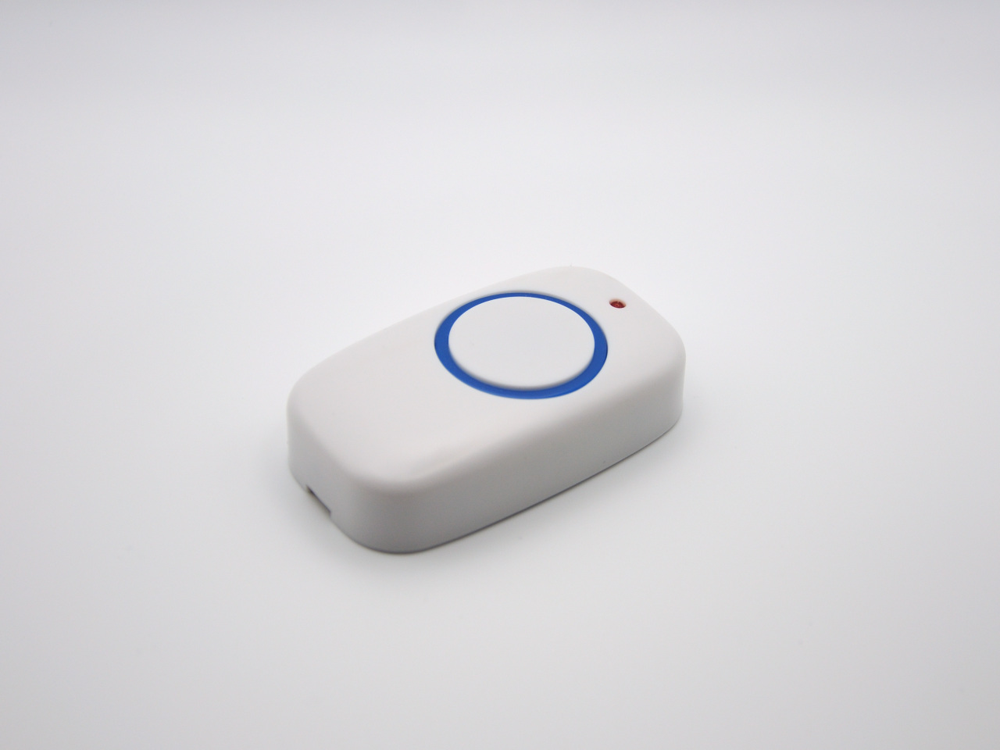
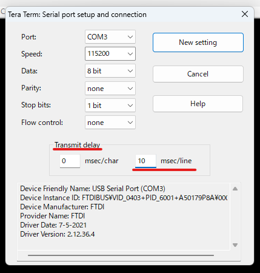
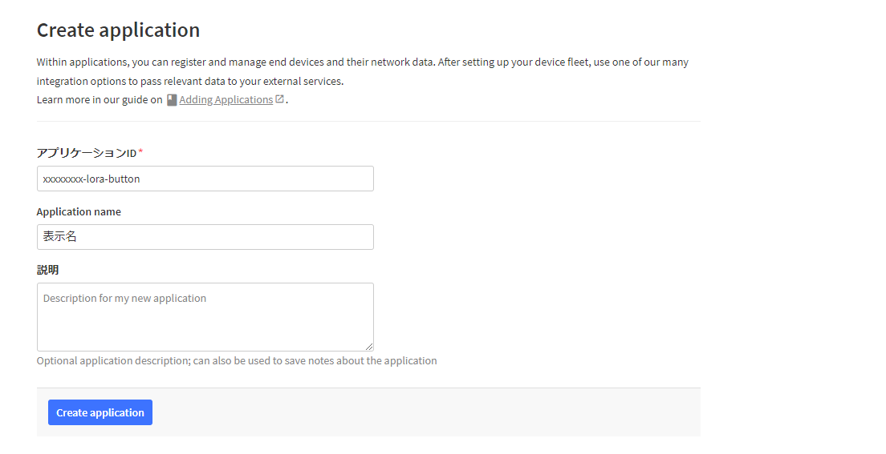
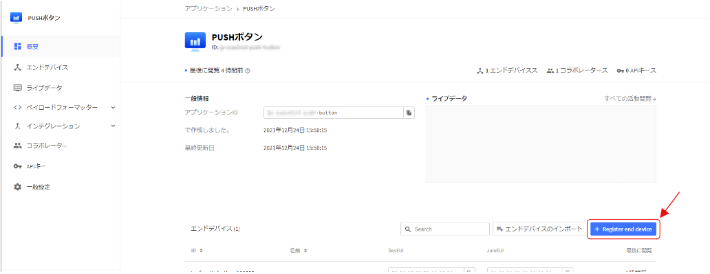
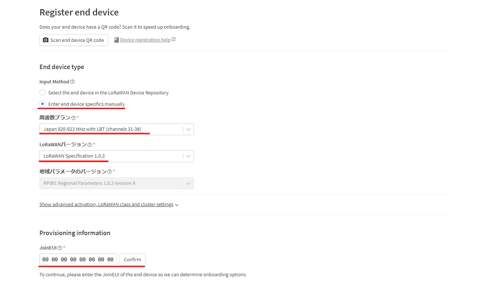
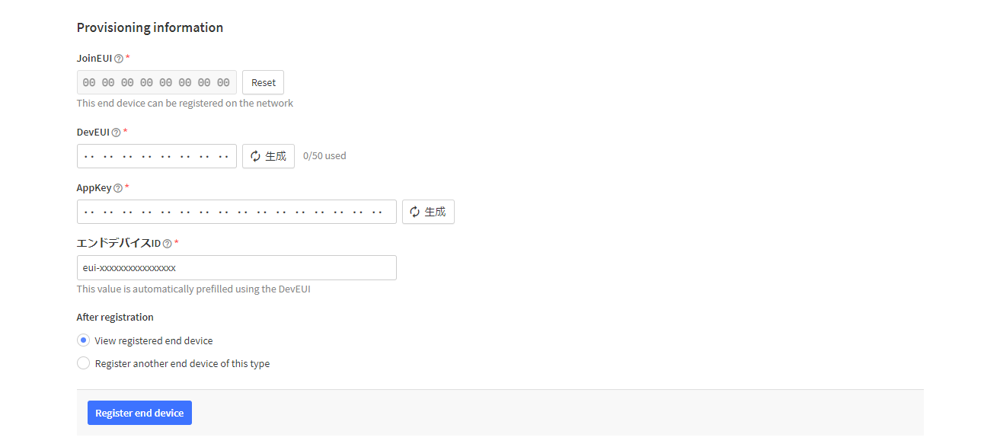
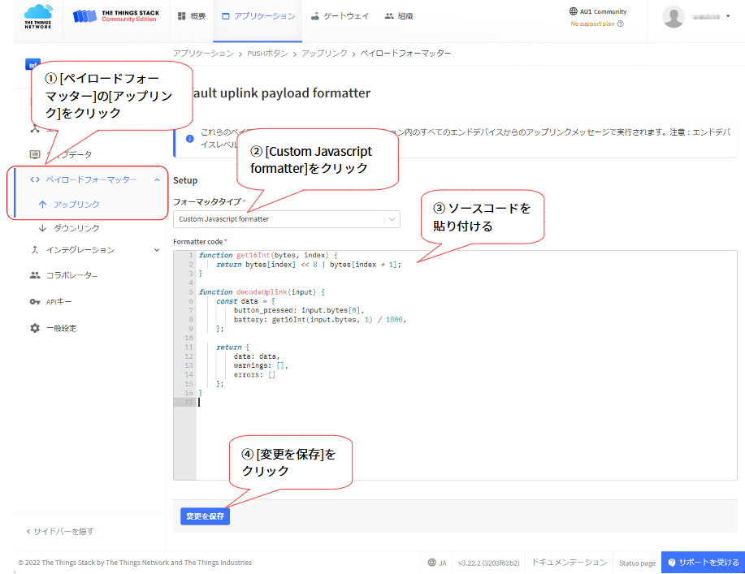
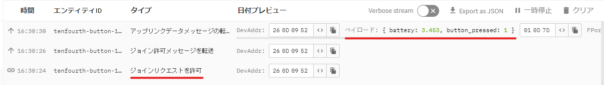

# LoRa Button


このページはテンフォースが販売する、LoRa Buttonのドキュメントやサンプルコードを公開しています。

このリポジトリの全てのファイルは MIT ライセンスです。

## コンテンツ

* [注意](#note)
* [本製品の使い方](#howtouse)
* [LoRaWANで使う](#lorawan)
* [製品仕様](#specification)
* [製品写真](#pictures)

<a id="note"></a>
# 取り扱い上の注意

* 本製品は日本国内専用です。海外ではチャンネルや出力など電波の仕様が異なるためご利用になれません
* 直射日光の当たる場所や高温多湿の場所を避けてご利用ください
* 防水ではありませんので、水のかからない場所でご利用ください
* 生命や財産に関わるような重要な用途のご利用では、責任は負えません
* 消耗した電池は早めに取り出してください。液漏れして製品や周辺の物を痛めてしまいます

<a id="howtouse"></a>
# 本製品の使い方

## 必要な物

LoRa Buttonを使うためには、次の物が必要です

1. パソコン
    * ターミナル操作でLoRa Buttonの設定やプログラムを登録するために必要です
    * 通信モジュールのアップデートではWindowsパソコンが必要になります
2. USBシリアル変換ケーブル
    * パソコンとマイコンを繋ぐUART 3.3Vの一般的なシリアル変換ケーブル。秋月電子などの電子部品を扱うショップで入手可能です。 ([一例](https://akizukidenshi.com/catalog/g/gK-01977/)
3. LoRaWAN サーバー
    * [The Things Network](https://www.thethingsnetwork.org/) や、[LORIOT](https://www.loriot.io/) などのLoRaWANのサービス、もしくは自前で運用するサーバー、LoRaWANサーバー機能内蔵のGateway機器などが別途必要です
4. LoRaWAN Gateway
    * 日本国内の電波仕様に準拠したGateway機器をご用意ください
5. コイン形リチウム電池 CR2032 ×1

## フタの開け方と閉め方

隙間からマイナスドライバー等を差し込んで、爪をずらすように動かすとフタが外れます。

閉める時は、凸部のある向きを合わせ、爪のある方を中に向けて上からカチッと音がするまで押し込みます。

## 電池の入れ方と取り出し方

```
電池の端子がネジの頭や金属部分に触れてショートしないようにご注意ください
```

コイン形電池のマイナスを基板側に向けて、ホルダー部分へスライドして押し込みます。

電池取り出し用治具で「+」の刻印のある付近の隙間から電池を上に押し込んで飛び出させます。電池がホルダーからある程度飛び出したら、指でずらして取り出せます。

## ターミナル

LoRa Buttonのピンとシリアル変換の端子を次のように繋ぎます。(TxとRxは交わるように繋ぎます)

* Tx を Rx へ
* Rx を Tx へ
* GND を GND へ

```
[RESET]ピンはモジュールを再起動したい時に、[GND]ピンと繋ぐことで再起動できます
```

パソコンで [Tera Term](https://ja.osdn.net/projects/ttssh2/) などのターミナルソフトを起動します。

### シリアルの設定

シリアルポートは次の通りに設定します。

| 項目| 値 |
|:---:|:--:|
| ボーレート | 115200bps |
| データ | 8bit |
| パリティ | none |
| ストップビット | 1bit |
| フロー制御 | none |

送信遅延の項目があれば設定します。Tera Termでは `Transmit delay` という項目がありますので、1行毎に10 msec程度の遅延を入れます



遅延の設定をしないと、後述の手順でプログラムを貼り付けする際に一部が抜ける可能性があります。

ターミナルを接続して、LoRa Buttonの電源が入るとプロンプトが表示されます。

```:LRA1プロンプト
i2-ele LRA1
Ver 1.13.h
OK
>
```

* プログラムが書き込まれてて、自動的に実行するようになっている場合はバージョン番号の下の行に `.` が増えていく状態になります。`.` が5つになる前に `Ctrl キー` と `c` を同時に押すとプロンプト `>` (コマンド待ち)の状態になります
* ターミナルに何も表示されない場合は、モジュールがスリープ状態になっている可能性がありますので、[RESET]ピンと[GND]ピンを繋いで再起動させてみてください

送信出力やデータレート等の設定はターミナルのコマンドで行います。

ターミナルの使い方やコマンドは、モジュール製造元（[株式会社アイ・ツー](https://i2-ele.co.jp/)）の [ソフトウェアリファレンスマニュアル](https://www.i2-ele.co.jp/LRA1_software.html) や [LRA1コマンド一覧](https://i2-ele.co.jp/LRA1-command.html) をご参照ください。

## プログラムの書込み

1. `EDIT 1` を入力して[Enter]
    * プロンプトが `>` から `>>` に変わることを確認します
2. `NEW` を入力して[Enter]
3. [BASICプログラム](sample-codes/lra1-basic/lorawan.bas)をコピーペーストで貼り付けします
4. `PSAVE` を入力して[Enter]
5. `AUTO="PLOAD:RUN":SSAVE` を入力して[Enter]
    * このコマンドで起動時にプログラムが自動的に実行されるようになります
    * 既に自動実行が設定されている場合は、何度も設定し直す必要はありません
    * 自動的に実行しないようにするには `AUTO="":SSAVE` として、AUTOの設定を空にします
6. `RESET` を入力して[Enter]キーを押し、再起動後にJOINが実行されることを確認します
    * この時点ではLoRaWANサーバー側の設定がされてないので、 `timeout` が表示されます

## ボタンの動作

ボタンの押し方は `1回押し` 、`2回押し` 、 `3回押し` 及び、3秒以上の `長押し` の4通りがあります。

ボタンを押した時にLEDが点灯し、離した時に消灯します。離してからLEDが消灯するまでに、若干のタイムラグがあります。LEDが消える前に再度ボタンを押すと継続して押されている状態となり、押した回数がカウントされませんので、消えたのを確認してから押します。

ボタンを押してから少し待つと、LEDが押されたボタンの回数点滅するか、3秒間点灯(長押し時)して、フィードバックを行います。

フィードバックの後にデータを送信して、成功した場合は約3秒点灯し、失敗した場合は点滅します。
送信してからLEDが光るまでに約5秒かかります。その間はボタンを押しても何の反応も行いません。

JOINが成功していない間は、フィードバックはされずに点滅になります。

<a id="lorawan"></a>
# LoRaWANで使う

ここでは、[The Things Network](https://www.thethingsnetwork.org/) を例にしてアプリケーションのノードにLoRa Buttonを登録する手順を紹介します。

予め、The Things Networkのアカウントの用意とゲートウェイの登録が済んでいる状態とします。

## アプリケーションの登録

アプリケーションを新しく作成して、LoRa Buttonの機能(ボタンが押されたらデータが届く)をThe Things Networkに登録します。

アプリケーションの画面を開きます

[Create application]をクリックすると、「Create application」の画面が表示されます。



「アプリケーションID」には小文字の英字、数字と `-` の組み合わせで任意に決めます。

アカウント名などの自分が使っていると分かるようなユニークな名前とButtonで使うことが分かるような文字列を組み合わせるのが良いかもしれません。例えば「(何かユニークな名前)-lora-button」。ボタンが何に使うかが明確であれば、「lora-button」ではなく目的を示す名前にしても良いです。

IDは一度決めると後から変更することはできず、アプリケーションを削除すると、再度作り直したアプリケーションで同じIDを付けることはできませんのでご注意ください。

「Application name」は画面に表示される名前です。任意に決められ、省略可能です。

「説明」は必要に応じて登録できます。任意ですので空欄でも構いません。

[Create application]をクリックすると、アプリケーションが作成されます

### エンドデバイスの追加

アプリケーションの「概要」のページを表示して、[Register end device]をクリックします。



「Register end device」の画面が表示されます。



「Enter end device specifies manually」を選択します。

周波数プランはゲートウェイが8チャンネル(もしくは不明)であれば `Japan 920-923 MHz with LBT (channels 31-38)` 、ゲートウェイが16チャンネルであれば `Japan 920-923 MHz with LBT (channels 24-27 and 35-38)` を選びます。ゲートウェイも可能であればこちらのいずれかのチャンネルに合わせるのが理想です。

LoRaWANバージョンは `LoRaWAN Specification 1.0.3` を選びます。

地域パラメータのバージョンは選択不可になりますが、 `RP001 Regional Parameters 1.0.3 revision A` が選択されます。

JoinEUIは `0000000000000000` を入力します。入力欄の空白は自動的に付けられます。

[Confirm]をクリックすると、「Provisioning information」の欄が表示されます



DevEUIにはLoRa Buttonのラベルに記載された「DevEUI」の値を入力します。ラベルのQRコードを読み込んで取得することもできますが、読み込めない場合はターミナルから `? WAN_DEVEUI` コマンドで確認することもできます。入力した値は大文字に変換されますが、設定には影響ありません。

AppKeyは[生成]をクリックして生成された値をLoRa Buttonに設定します。ターミナルで以下の操作を行います

1. [RESET]ピンと[GND]ピンを繋ぎ、LoRa Buttonを再起動します
2. ターミナルでバージョン番号の下の `.` が5つになる前に `Ctrl` キーと `c` を同時に押して、プロンプト `>` の状態にします
3. 生成されたAppKeyを、 `$""` の `"～"` の間に挟んで設定します
```
PASS=999999
WAN_APPKEY=$"xxxx..."
SSAVE
```
4. [RESET]ピンと[GND]ピンを繋ぎ、LoRa Buttonを再起動します

[Register end device]をクリックしてエンドデバイスを登録します

複数のLoRa Buttonを使う時は、別のButtonも同様にエンドデバイスに登録します

## ペイロードフォーマッタの登録

アプリケーションの画面を表示して、以下の操作を行います。

1. [ペイロードフォーマッター]の[アップリンク]をクリックします
2. [Custom Javascript formatter] をクリックします
3. [ペイロードフォーマッターのソースコード](sample-codes/ttn-payload-formatter/format.js)をコピーペーストで貼り付けします
4. [変更を保存]をクリックします



## データの確認

アプリケーションの画面を表示して、[ライブデータ] をクリックします。

LoRa Buttonのボタンを押した時に、JOINが行われ、アップリンクメッセージが届く事を確認します。この時、ペイロードに `battery` (電池電圧)と `button_pressed` (押されたボタンの種別) が含まれ、ペイロードフォーマッタのパースが出来ていることを確認します。



### battery

ボタン電池の電圧(V単位)を示します。新品の電池では `3.3` に近い値となりますが、使用するに従って下がっていきます。目安として `2.8` を下回ったら新しい電池に交換することを推奨いたします。

### button_press

ボタンの押し方によって次に示す値になります。

| 値 | 意味 |
|:---:|:---|
| 0 | 電池挿入時など、ボタンが押されずに送信された場合 |
| 1 | ボタンが1回押された場合 |
| 2 | ボタンが2回押された場合 |
| 3 | ボタンが3回押された場合 |
| 11 | ボタンが長押し(3秒以上)された場合 |

以上の手順で、LoRa ButtonがThe Things Networkで繋がる所まで出来ました。

<a id="specification"></a>
# 製品仕様

| 項目 | 内容 |
|:---:|:---:|
| 品名 | LoRa Button |
| インタフェース | 赤色LED x1、押ボタン x1 |
| 本体サイズ | 4.1W x 7.1D x 1.7H cm |
| 重量 | 26g (電池含まず) |
| 電源 | コイン形リチウム電池 CR2032 ×1 |
| 電池寿命 | 約数ヶ月～数年 (送信間隔によります) |
| 通信モジュール | 株式会社アイ・ツー [LRA1](https://i2-ele.co.jp/LoRa.html) |
| 無線準拠規格 | 無線準拠規格国内電波法認証済み |
| 製造 | 日本 |

<a id="pictures"></a>
# 製品写真

* [製品写真のディレクトリ](/img/button-images) に配置しております